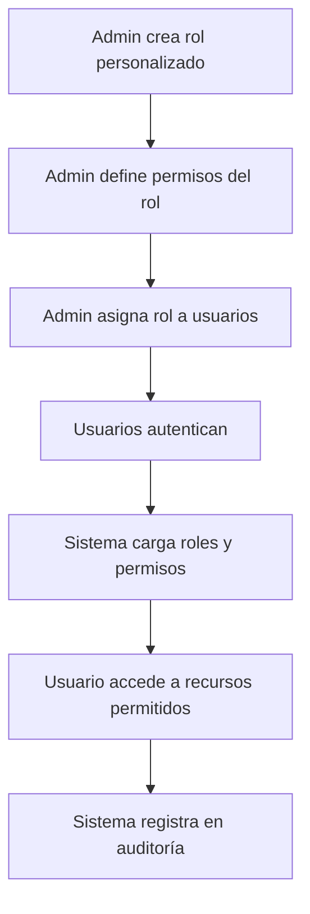

# Guía de Uso: Sistema RBAC

##  Índice
1. [Conceptos Básicos](#conceptos-básicos)
2. [Gestión de Roles](#gestión-de-roles)
3. [Gestión de Permisos](#gestión-de-permisos)
4. [Asignación de Roles a Usuarios](#asignación-de-roles-a-usuarios)
5. [Protección de Endpoints](#protección-de-endpoints)
6. [Ejemplos Prácticos](#ejemplos-prácticos)
7. [Mejores Prácticas](#mejores-prácticas)

## Conceptos Básicos

### ¿Qué es RBAC?

RBAC (Role-Based Access Control) es un sistema de control de acceso donde:
- Los **usuarios** tienen **roles**
- Los **roles** tienen **permisos**
- Los **permisos** definen acceso a recursos específicos

### Estructura de Permisos

```
permiso = recurso.accion

Ejemplos:
- usuarios.leer    → Ver usuarios
- usuarios.crear   → Crear usuarios
- alertas.leer     → Ver alertas
- alertas.eliminar → Eliminar alertas
```

### Jerarquía

```
Usuario → Rol(es) → Permiso(s) → Recurso
```

Un usuario puede tener múltiples roles, y cada rol puede tener múltiples permisos.

## Gestión de Roles

### Listar Roles Disponibles

```bash
curl -X GET http://localhost:8000/api/rbac/roles \
  -H "Authorization: Bearer YOUR_TOKEN"
```

**Response:**
```json
[
  {
    "id": 1,
    "nombre": "Administrador",
    "descripcion": "Acceso completo al sistema",
    "activo": true,
    "fecha_creacion": "2025-01-21T10:00:00",
    "permisos": [
      "usuarios.leer",
      "usuarios.crear",
      "usuarios.actualizar",
      "usuarios.eliminar",
      "roles.leer",
      "roles.crear",
      ...
    ]
  }
]
```

### Crear Rol Personalizado

```bash
curl -X POST http://localhost:8000/api/rbac/roles \
  -H "Authorization: Bearer YOUR_TOKEN" \
  -H "Content-Type: application/json" \
  -d '{
    "nombre": "Supervisor Regional",
    "descripcion": "Supervisor de operaciones regionales",
    "activo": true,
    "permisos": [
      "alertas.leer",
      "alertas.crear",
      "alertas.actualizar",
      "alertas.clasificar",
      "reportes.leer",
      "reportes.generar"
    ]
  }'
```

**Response:**
```json
{
  "id": 5,
  "nombre": "Supervisor Regional",
  "descripcion": "Supervisor de operaciones regionales",
  "activo": true,
  "fecha_creacion": "2025-01-21T14:30:00",
  "permisos": [
    "alertas.leer",
    "alertas.crear",
    "alertas.actualizar",
    "alertas.clasificar",
    "reportes.leer",
    "reportes.generar"
  ]
}
```

### Actualizar Rol

```bash
curl -X PUT http://localhost:8000/api/rbac/roles/5 \
  -H "Authorization: Bearer YOUR_TOKEN" \
  -H "Content-Type: application/json" \
  -d '{
    "descripcion": "Supervisor regional con acceso a usuarios",
    "permisos": [
      "usuarios.leer",
      "alertas.leer",
      "alertas.crear",
      "alertas.actualizar",
      "alertas.clasificar",
      "reportes.leer",
      "reportes.generar"
    ]
  }'
```

### Desactivar Rol

```bash
curl -X DELETE http://localhost:8000/api/rbac/roles/5 \
  -H "Authorization: Bearer YOUR_TOKEN"
```

**Nota:** Los roles se desactivan (soft delete), no se eliminan físicamente.

## Gestión de Permisos

### Listar Todos los Permisos

```bash
curl -X GET http://localhost:8000/api/rbac/permisos \
  -H "Authorization: Bearer YOUR_TOKEN"
```

### Filtrar Permisos por Recurso

```bash
# Obtener todos los permisos de "alertas"
curl -X GET http://localhost:8000/api/rbac/recursos/alertas/permisos \
  -H "Authorization: Bearer YOUR_TOKEN"
```

**Response:**
```json
[
  {
    "id": 9,
    "codigo": "alertas.leer",
    "nombre": "Leer Alertas",
    "descripcion": "Ver alertas del sistema",
    "recurso": "alertas",
    "accion": "leer",
    "fecha_creacion": "2025-01-21T10:00:00"
  },
  {
    "id": 10,
    "codigo": "alertas.crear",
    "nombre": "Crear Alertas",
    "descripcion": "Crear nuevas alertas",
    "recurso": "alertas",
    "accion": "crear",
    "fecha_creacion": "2025-01-21T10:00:00"
  },
  ...
]
```

## Asignación de Roles a Usuarios

### Asignar Roles

```bash
curl -X POST http://localhost:8000/api/rbac/usuarios/123/roles \
  -H "Authorization: Bearer YOUR_TOKEN" \
  -H "Content-Type: application/json" \
  -d '{
    "roles": [2, 3]
  }'
```

**Nota:** Esto reemplaza los roles actuales con los nuevos.

### Ver Roles de Usuario

```bash
curl -X GET http://localhost:8000/api/rbac/usuarios/123/roles \
  -H "Authorization: Bearer YOUR_TOKEN"
```

**Response:**
```json
[
  {
    "id": 2,
    "nombre": "Analista",
    "descripcion": "Analista de alertas y reportes",
    "activo": true,
    "fecha_creacion": "2025-01-21T10:00:00",
    "permisos": [
      "alertas.leer",
      "alertas.crear",
      "alertas.actualizar",
      "alertas.clasificar",
      "reportes.leer",
      "reportes.generar",
      "usuarios.leer"
    ]
  }
]
```

### Ver Permisos Efectivos de Usuario

```bash
curl -X GET http://localhost:8000/api/rbac/usuarios/123/permisos \
  -H "Authorization: Bearer YOUR_TOKEN"
```

Esta llamada retorna todos los permisos únicos que tiene el usuario a través de todos sus roles.

### Verificar Permiso Específico

```bash
curl -X GET "http://localhost:8000/api/rbac/usuarios/123/permisos/alertas.crear/verificar" \
  -H "Authorization: Bearer YOUR_TOKEN"
```

**Response:**
```json
{
  "usuario_id": 123,
  "permiso": "alertas.crear",
  "tiene_permiso": true
}
```

### Verificar Rol Específico

```bash
curl -X GET "http://localhost:8000/api/rbac/usuarios/123/roles/Analista/verificar" \
  -H "Authorization: Bearer YOUR_TOKEN"
```

## Protección de Endpoints

### En tu Código: Requerir Permisos

```python
from fastapi import APIRouter, Depends
from app.core.dependencies import requiere_permisos, requiere_roles
from app.schemas.auth import UsuarioActual

router = APIRouter()

# Endpoint protegido por permiso
@router.post("/alertas")
async def crear_alerta(
    usuario_actual: UsuarioActual = Depends(requiere_permisos(["alertas.crear"]))
):
    # Solo usuarios con permiso "alertas.crear" pueden acceder
    return {"mensaje": "Alerta creada"}

# Endpoint protegido por múltiples permisos (requiere TODOS)
@router.delete("/alertas/{alerta_id}")
async def eliminar_alerta(
    alerta_id: int,
    usuario_actual: UsuarioActual = Depends(
        requiere_permisos(["alertas.eliminar", "alertas.leer"])
    )
):
    # Usuario debe tener AMBOS permisos
    return {"mensaje": "Alerta eliminada"}

# Endpoint protegido por rol
@router.get("/admin/stats")
async def obtener_estadisticas_admin(
    usuario_actual: UsuarioActual = Depends(requiere_roles(["Administrador"]))
):
    # Solo usuarios con rol "Administrador"
    return {"estadisticas": "..."}

# Múltiples roles permitidos (requiere AL MENOS UNO)
@router.get("/reportes")
async def obtener_reportes(
    usuario_actual: UsuarioActual = Depends(
        requiere_roles(["Administrador", "Analista", "Auditor"])
    )
):
    # Usuario debe tener al menos uno de estos roles
    return {"reportes": "..."}
```

### Verificación Manual en Lógica de Negocio

```python
from app.services.rbac_service import RBACService

async def proceso_complejo(usuario_id: int, db: AsyncSession):
    rbac_service = RBACService(db)
    
    # Verificar permiso específico
    puede_generar_reporte = await rbac_service.usuario_tiene_permiso(
        usuario_id,
        "reportes.generar"
    )
    
    if not puede_generar_reporte:
        raise AuthorizationError("No tiene permiso para generar reportes")
    
    # Continuar con la lógica...
```

## Ejemplos Prácticos

### Escenario 1: Crear Rol para Soporte Técnico

```bash
# 1. Crear rol
curl -X POST http://localhost:8000/api/rbac/roles \
  -H "Authorization: Bearer $ADMIN_TOKEN" \
  -H "Content-Type: application/json" \
  -d '{
    "nombre": "Soporte Técnico",
    "descripcion": "Personal de soporte técnico con acceso limitado",
    "activo": true,
    "permisos": [
      "usuarios.leer",
      "alertas.leer",
      "reportes.leer",
      "auditoria.leer"
    ]
  }'

# 2. Asignar rol a usuario
curl -X POST http://localhost:8000/api/rbac/usuarios/456/roles \
  -H "Authorization: Bearer $ADMIN_TOKEN" \
  -H "Content-Type: application/json" \
  -d '{
    "roles": [6]
  }'
```

### Escenario 2: Auditoría de Permisos de Usuario

```bash
# 1. Obtener usuario actual con roles y permisos
curl -X GET http://localhost:8000/api/auth/me \
  -H "Authorization: Bearer $USER_TOKEN"

# Response incluye:
{
  "id": 456,
  "nombre_usuario": "jperez",
  "roles": ["Soporte Técnico"],
  "permisos": [
    "usuarios.leer",
    "alertas.leer",
    "reportes.leer",
    "auditoria.leer"
  ]
}

# 2. Verificar permisos específicos
curl -X GET "http://localhost:8000/api/rbac/usuarios/456/permisos/alertas.eliminar/verificar" \
  -H "Authorization: Bearer $ADMIN_TOKEN"

# Response:
{
  "usuario_id": 456,
  "permiso": "alertas.eliminar",
  "tiene_permiso": false
}
```

### Escenario 3: Actualizar Permisos de Rol Existente

```bash
# Un analista necesita ahora poder eliminar alertas
curl -X PUT http://localhost:8000/api/rbac/roles/2 \
  -H "Authorization: Bearer $ADMIN_TOKEN" \
  -H "Content-Type: application/json" \
  -d '{
    "permisos": [
      "alertas.leer",
      "alertas.crear",
      "alertas.actualizar",
      "alertas.eliminar",
      "alertas.clasificar",
      "reportes.leer",
      "reportes.generar",
      "usuarios.leer"
    ]
  }'
```

### Escenario 4: Usuario con Múltiples Roles

```bash
# Asignar rol "Analista" Y "Auditor" a un usuario
curl -X POST http://localhost:8000/api/rbac/usuarios/789/roles \
  -H "Authorization: Bearer $ADMIN_TOKEN" \
  -H "Content-Type: application/json" \
  -d '{
    "roles": [2, 4]
  }'

# El usuario tendrá la unión de permisos de ambos roles
```

## Mejores Prácticas

### 1. Principio de Menor Privilegio

 **Hacer:**
```bash
# Crear roles específicos con permisos mínimos necesarios
{
  "nombre": "Consultor Externo",
  "permisos": ["alertas.leer", "reportes.leer"]
}
```

 **Evitar:**
```bash
# Dar permisos excesivos
{
  "nombre": "Consultor Externo",
  "permisos": ["alertas.*", "reportes.*", "usuarios.*"]  # Demasiado acceso
}
```

### 2. Roles Granulares vs Roles Amplios

 **Roles bien definidos:**
- `Analista Nivel 1` - Permisos básicos
- `Analista Nivel 2` - Permisos intermedios
- `Analista Senior` - Permisos avanzados

### 3. No Modificar Roles del Sistema

 **Evitar:**
- Modificar roles con `es_sistema=true`
- Son roles base del sistema

 **Hacer:**
- Crear roles personalizados derivados

### 4. Auditoría Regular

```bash
# Revisar periódicamente qué usuarios tienen qué permisos
python scripts/manage_users.py listar
python scripts/manage_users.py ver-roles <usuario_id>
```

### 5. Nomenclatura Clara

 **Buenos nombres:**
- `Supervisor Regional Norte`
- `Analista Alertas Críticas`
- `Auditor Interno`

 **Malos nombres:**
- `Rol1`
- `TempRol`
- `Usuario Especial`

### 6. Documentar Roles Personalizados

Mantén un registro de:
- ¿Por qué se creó el rol?
- ¿Quién lo creó?
- ¿Qué casos de uso cubre?

### 7. Revisar Permisos Antes de Desactivar Roles

```bash
# Ver cuántos usuarios tienen un rol antes de desactivarlo
curl -X GET http://localhost:8000/api/rbac/roles/5 \
  -H "Authorization: Bearer $ADMIN_TOKEN"
```

### 8. Usar Roles, No Permisos Directos

 **Correcto:**
```python
# Asignar rol "Analista" a usuario
await rbac_service.asignar_roles_a_usuario(user_id, [rol_analista_id])
```

 **Incorrecto:**
```python
# Asignar permisos directamente al usuario (no soportado)
# El sistema usa roles como intermediarios
```

## Flujo Típico de Administración



## Troubleshooting

### Usuario no puede acceder a recurso

1. Verificar usuario tiene el permiso:
```bash
curl -X GET "http://localhost:8000/api/rbac/usuarios/{id}/permisos/{permiso}/verificar"
```

2. Ver roles del usuario:
```bash
curl -X GET "http://localhost:8000/api/rbac/usuarios/{id}/roles"
```

3. Verificar que los roles estén activos
4. Verificar que el usuario esté activo

### Error "No autorizado" en endpoint

1. Verificar token válido
2. Verificar permisos requeridos por el endpoint
3. Verificar roles del usuario
4. Revisar logs de auditoría

## Recursos Adicionales

- **Documentación de API**: http://localhost:8000/docs
- **Arquitectura del Sistema**: `ARQUITECTURA.md`
- **CLI de Usuarios**: `scripts/manage_users.py`
- **Inicialización**: `scripts/init_db.py`
